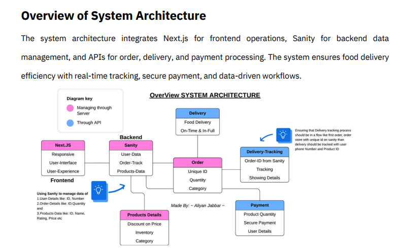
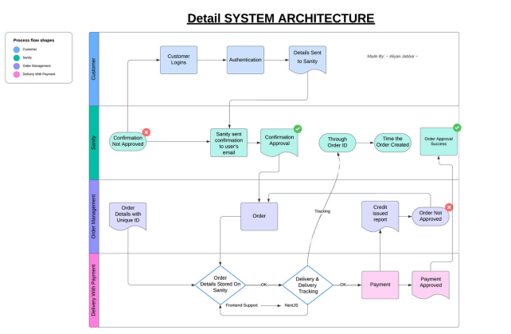

# Food Chukh

Food Chukh is a web application developed during a hackathon to provide users with an interactive platform for exploring and sharing culinary experiences. The application allows users to discover new recipes, share their own creations, and connect with a community of food enthusiasts.

## Features

- **Recipe Discovery**: Browse a wide variety of recipes submitted by users.
- **User Submissions**: Share your own recipes with the community.
- **Community Interaction**: Engage with other users through comments and ratings.
- **Personalized Recommendations**: Receive suggestions based on your preferences.
- **Responsive Design**: The application provides full responsiveness to it's users.
- **Cross Browser Compatibility**: Users can use this website on their desired browser.

## Dependencies

- **Next.js**: A React framework for server-side rendering and generating static websites.
- **Tailwind CSS**: A utility-first CSS framework for styling.
- **Daisy UI**: External library for better UI/UX & ready to use design.
- **React Icons**: External library for desired icons.
- **Sanity.io**: A platform for structured content, used as the content management system.

## Configuration

The project configurations includes:

- **Next.js Configuration**: Located in `next.config.mjs`.
- **Tailwind CSS Configuration**: Located in `tailwind.config.ts`.
- **Sanity Configuration**: Located in `sanity.config.ts` and `sanity.cli.ts`.

## Documentation
- **System Architecture**
 

 
For detailed information on the project's architecture, components, and APIs, refer to the documentation available in the `documentation` folder of the repository.

## Contributors

- **Aliyan Jabbar**: [GitHub Profile](https://github.com/AliyanJabbar)

## License

This project is licensed under the MIT License. See the LICENSE file for details.
